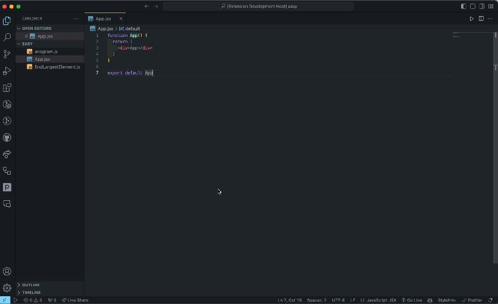

# QuickGist

QuickGist is a Visual Studio Code extension that allows you to quickly generate gists for the active file or selected text and generates a short URL for easy sharing.

## Features

- **Create Gist File:** Generate a gist for the entire content of your active file.
- **Create Gist for Selection:** Produce a gist for the selected text within your active file.
- **Generate Short Gist URL for File:** Create a short URL for your Gist file for convenient sharing.
- **Generate Short Gist URL for Selection:** Obtain a short URL for your Gist selection for quick sharing.

## Installation

1. Open Visual Studio Code.
2. Go to the Extensions view (`Ctrl + Shift + X` or `Cmd + Shift + X` on macOS).
3. Search for `QuickGist`.
4. Click the Install button.

## Notifications

Ensure that notifications are enabled on the bottom right corner to get the copy url button. .

## Usage

### Create Gist File

1. Open the file you want to share.
2. Run the command `QuickGist: Create Gist File`.
3. A short URL for your Gist will be generated and displayed.

### Create Gist for Selection

1. Select the text you want to share.
2. Run the command `QuickGist: Create Gist for Selection`.
3. A short URL for your Gist will be generated and displayed.

### Generate Short Gist URL for File

1. Open the file you want to share.
2. Run the command `QuickGist: Generate Short Gist URL for File`.
3. A short URL for your Gist will be generated and displayed.

### Generate Short Gist URL for Selection

1. Select the text you want to share.
2. Run the command `QuickGist: Generate Short Gist URL for Selection`.
3. A short URL for your Gist will be generated and displayed.

## Feedback

Found a bug or have a suggestion? Feel free to [open an issue](https://github.com/HAPPYS1NGH/quick-gist/issues).

## License

This project is licensed under the [MIT License](LICENSE).

---

**Enjoy Gisting with QuickGist! 🚀**
